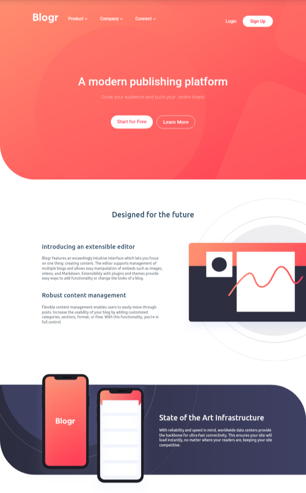

# Frontend Mentor - Blogr landing page solution

This is a solution to the [Blogr landing page challenge on Frontend Mentor](https://www.frontendmentor.io/challenges/blogr-landing-page-EX2RLAApP). Frontend Mentor challenges help you improve your coding skills by building realistic projects. 

## Built with

- Semantic HTML5 markup
- CSS custom properties
- Javascript
- Tailwindcss
- Flexbox
- Mobile-first workflow

## Demo

- Demo URL: [https://arjawa.github.io/blogr-landing-page](https://arjawa.github.io/blogr-landing-page)

## Screenshots

#### Desktop

#### Mobile

## Credits

- My website - [https://arjawa.tk](https://arjawa.tk)
- Frontend Mentor - [@arjawa](https://www.frontendmentor.io/profile/arjawa)
